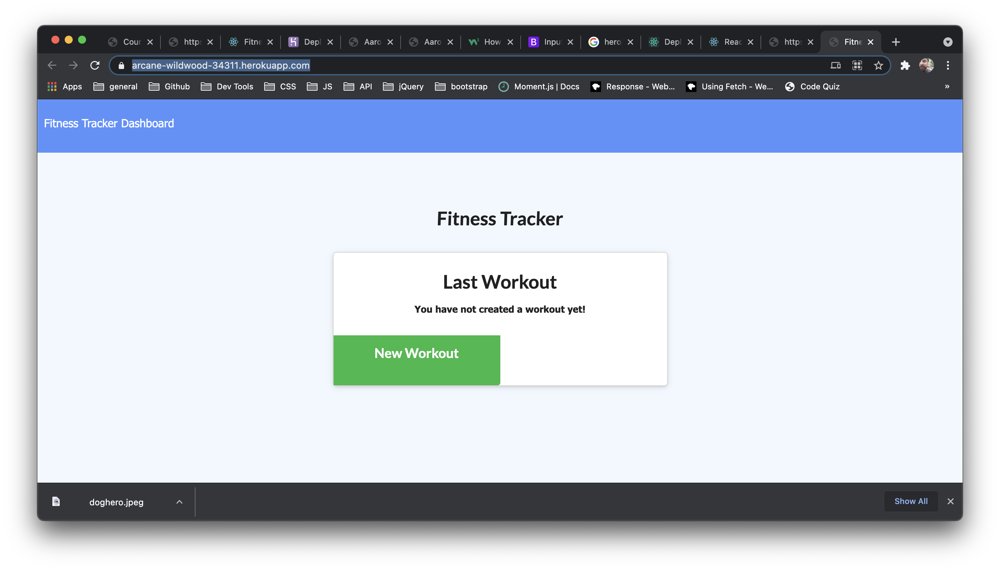

# Workout Tracker

## Table of contents
- [Description](#Description)
- [Installation](#Installation)
- [Usage](#Usage)
- [License](#License)
- [Technologies Used](#Technologies)
- [Contributors](#Contributors)
- [Tests](#Tests)
- [Repository Link](#Repository)
- [Deployed Link](#Deployed)

## Description 
The Workout Tracker application utilizes mongodb to allow the user to create, update, and save their workout data.

## Installation
Prerequisites to run the app: 
* Node.js
* Express.js
* MongoDB.

The user must clone the repository and run the following commands:

* npm i
* npm start

To seed the application, run:

* node seeders/seed.js

## Usage
This app helps a user create, update, and save workout data

## License
ISC

## Technologies
Node.js, Express.js, Mongoose, and MongoDB

## Contributors
Joshua Maney 

## Tests
N/A

## Repository
- https://github.com/joshuamaney/workout_tracker

## Deployed
- https://arcane-wildwood-34311.herokuapp.com/